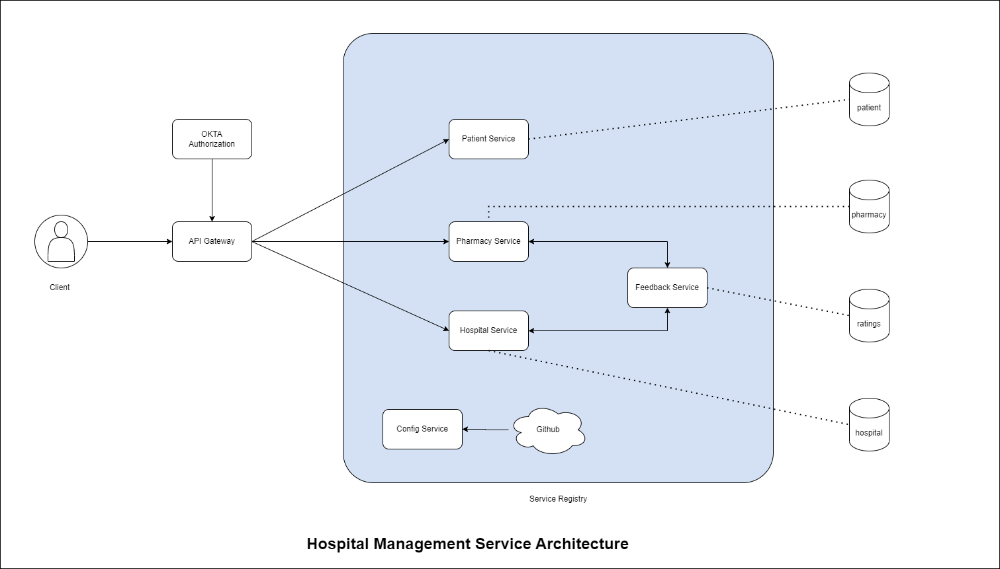

# hospital-management-system
Microservice based approach

---
# TODOs

- [x] Microservice
- [x] Rest Template config and use
- [x] Eureka registry
- [x] Spring JPA, Rest
- [x] Feign Client
- [x] API Gateway
- [ ] Resillience4j -> Circuit Breaker, Retry, Rate Limitter
- [ ] Unit Testing
- [x] Load Balancer
- [ ] Okta (Auth)
- [ ] Kafka
- [ ] ELK
- [ ] UI with Angular
- [ ] AWS (DB, Load Balancer, CI/CD, S3, ECS)
- [ ] Docker

---

# Architecture Diagram
## Backend:

---

Frontend:
---
## Configuration Details

| **Components** | **Technology** |
|:--------------:|:--------------:|
| Backend | Java 11, Spring Boot 2.7.2, Spring 5|
| Frontend | Angular 13.3.5 |
| Spring Security | Spring Security, Okta |
| Database | MySQL 8.0 |
| Server Build | Maven 3.8.4 |
| API Testing | Postman |
| API Documentation | OpenAPI (Swagger) |
| Tool | Intellij IDEA , VSCode |

---
# Open for collaboration
